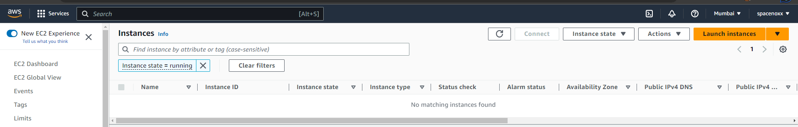
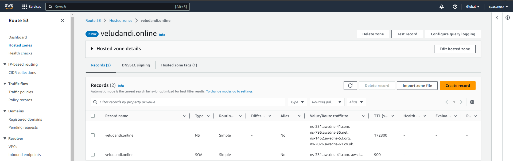
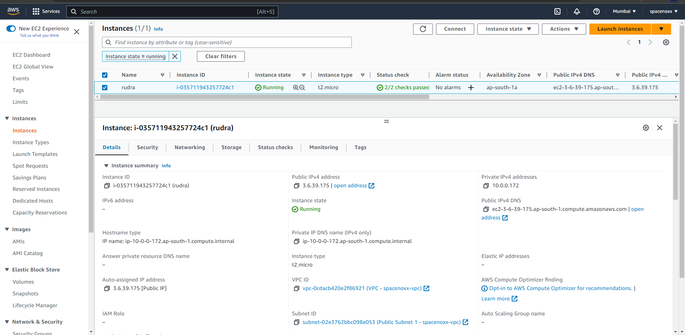
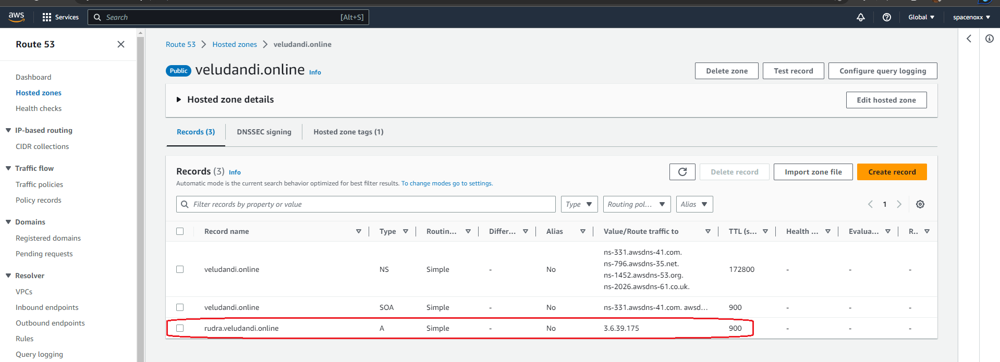

# RUDRA Shelcal PoC

## This PoC assumes the folloiwng:

1. An existing VPC in AWS
2. A public Subnet created in the above VPC
3. An exsiting AWS Key-Pair

## This PoC uses AWS CloudFormation template to:
1. Deploy an Linux EC2 instance in a precreated VPC with a Public Subnet
2. Create a Security Group that allows SSH access to 0.0.0.0/0 and attaches it to the Instance
3. Fetches the Public IP assigned to the EC2 instance and creates a DNS record called "rudra" in a hosted zone called "veludandi.online"

## Running Instances on AWS before Instance deployment

## HostedZone on AWS before DNS Record creation

## Running Instances on AWS after Instance deployment

## HostedZone on AWS after DNS Record creation

## To test the PoC in the region ap-south-1, do the following. You must already have the following (AWS Account with aws-cli configured)

You have to populate the `default` values of the below given parameters as needed in the `ec2-noip.yaml` template:

1. VpcId = 
2. ImageId = 
3. KeyName =
4. HostedZoneName = 
5. Hostname = 

Run the following command with aws-cli `aws cloudformation deploy --template-file ec2-noip.yaml --stack-name ec2-noip2 --region ap-south-1`

